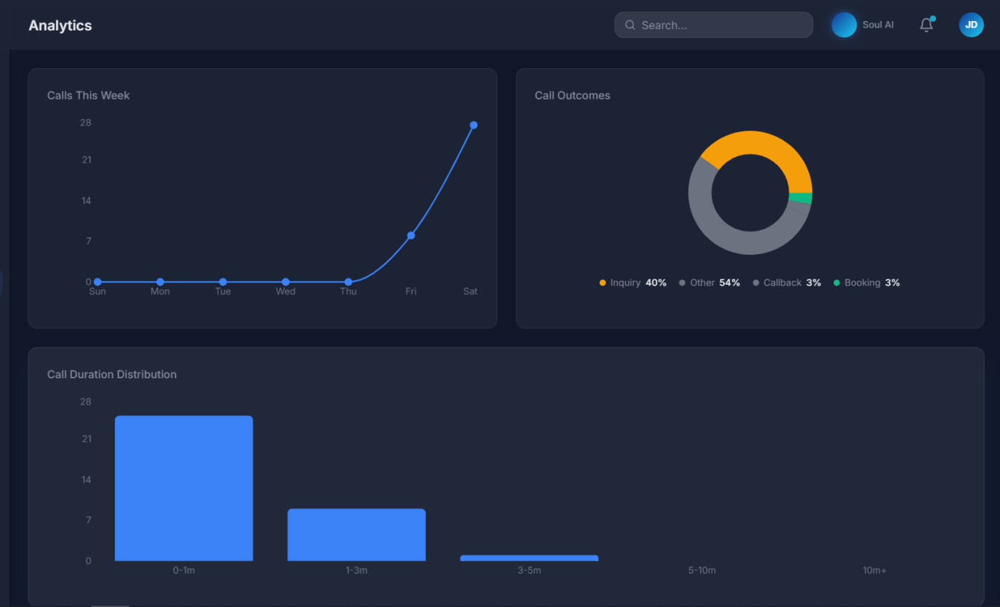
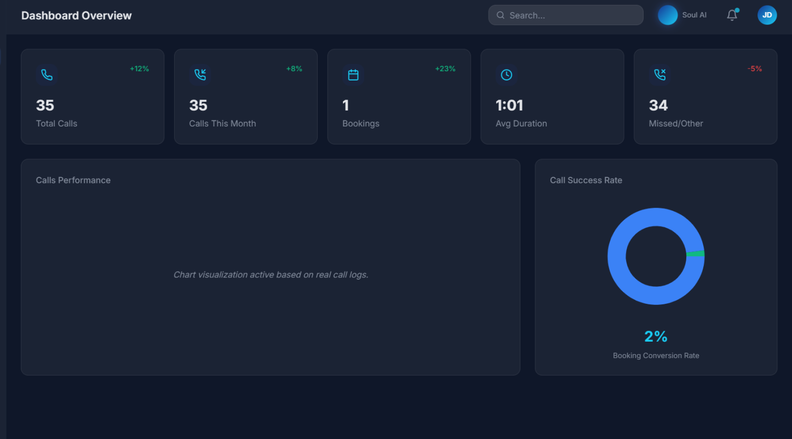
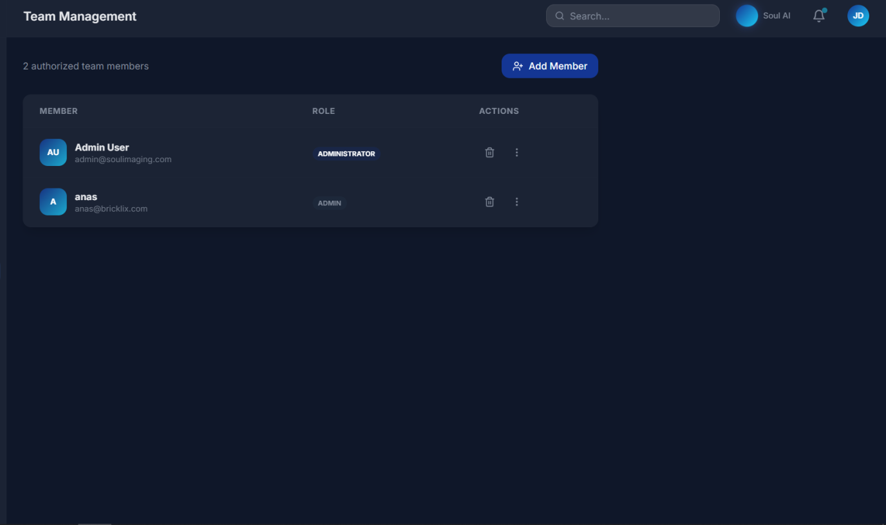

# 🎙️ Soul Imaging AI Voice Agent

[](https://soul-imaging-voice-agent.fly.dev/orb/)
[](https://opensource.org/licenses/MIT)
[](https://livekit.io)

### **Experience the Future of Radiology Patient Care**
A production-grade, ultra-low latency AI Voice Agent built for **Soul Imaging**. This agent handles inbound calls, answers medical policy questions using RAG, and books appointments seamlessly—all with a natural, human-like voice.

---

## 🚀 Live Testing
**Ready to witness the agent in action?**  
Click the link below to talk to the AI Orb directly from your browser:

👉 **[Launch Soul Imaging Voice Agent](https://soul-imaging-voice-agent.fly.dev/orb/)**

---

## 📸 Screenshots & Interface

### **Admin Control Center**
Manage your clinic's AI settings, monitor live calls, and view detailed analytics.


### **Analytics & Insights**
Track performance, call volume, and patient satisfaction through our premium dashboard.

| Call Volume Analytics | Patient Health Stats |
|:---:|:---:|
|  |  |

### **Operational Transparency**
Detailed call logs and member authorization management ensure every interaction is secure and recorded.

| Call Details & Transcripts | Authorized Members |
|:---:|:---:|
|  |  |

---

## 🛠 Enterprise Tech Stack

This project represents a **state-of-the-art** integration of modern AI and real-time communication technologies.

### **The "Brain" (AI & Voice)**
*   **LLM (Orchestrator)**: `OpenAI GPT-4o-mini` - Optimized for high-speed reasoning and function calling.
*   **TTS (Voice Synthesis)**: `Cartesia` - The gold standard in ultra-low latency, expressive AI voices.
*   **STT (Transcription)**: `Gladia.io` - Enterprise-grade speech-to-text with specialized medical term recognition.
*   **VAD (Voice Activity Detection)**: `Silero VAD` - High-precision silence and speech detection.

### **The "Nervous System" (Networking)**
*   **Real-time Protocol**: `LiveKit Agents SDK v1.5+` - Handling audio streams and WebRTC connections with zero jitter.
*   **Deployment**: `Fly.io` - Globally distributed Docker containers for minimal latency.

### **The "Memory" (Backend)**
*   **Database**: `Supabase` (PostgreSQL) - Persistent storage for call logs, patient data, and dashboard settings.
*   **Knowledge Base**: Custom **RAG Pipeline** (Retrieval-Augmented Generation) utilizing vector embeddings for clinic-specific knowledge.
*   **Scheduling**: `Cal.com API` - Real-time calendar synchronization for instant appointment booking.

### **The "Face" (Frontend)**
*   **Dashboard**: `React (Vite)` + `TailwindCSS` - A premium, dark-mode administrative experience.
*   **Voice UI**: `Vanilla JS/CSS` - An interactive, glassmorphism-inspired AI Orb that visualizes real-time audio frequencies.

---

## ✨ Professional Standards

*   **Concurrency Safe**: Uses a localized context pattern where every call is a unique instance, preventing data leakage between patients.
*   **Proactive Engagement**: The agent greets users immediately upon connection—no awkward silence.
*   **Interruption Handling**: Advanced turn-detection allows the AI to stop speaking instantly if the user interrupts.
*   **RAG-Powered**: Answers are pulled from real clinic documentation, not just GPT's general knowledge.

---

## 📂 Project Structure

```text
├── agent/                # Core Python Voice Agent (LiveKit Worker)
├── Production-Dashboard/ # React Admin Interface
├── screenshots/          # High-resolution UI captures
├── requirements.txt      # Python dependencies
└── fly.toml             # Production deployment config
```

---

## 🛠 Local Setup

1.  **Clone & Install**:
    ```bash
    git clone https://github.com/oan-ali/Soul-Imaging-Agent.git
    pip install -r requirements.txt
    ```

2.  **Environment Variables**:
    Create a `.env` file with `LIVEKIT_URL`, `LIVEKIT_API_KEY`, `OPENAI_API_KEY`, `CARTESIA_API_KEY`, and `SUPABASE_URL`.

3.  **Run the Agent**:
    ```bash
    python -m agent.main dev
    ```

---

© 2024 Soul Imaging. All Rights Reserved. Built with ❤️ for the future of radiology.
